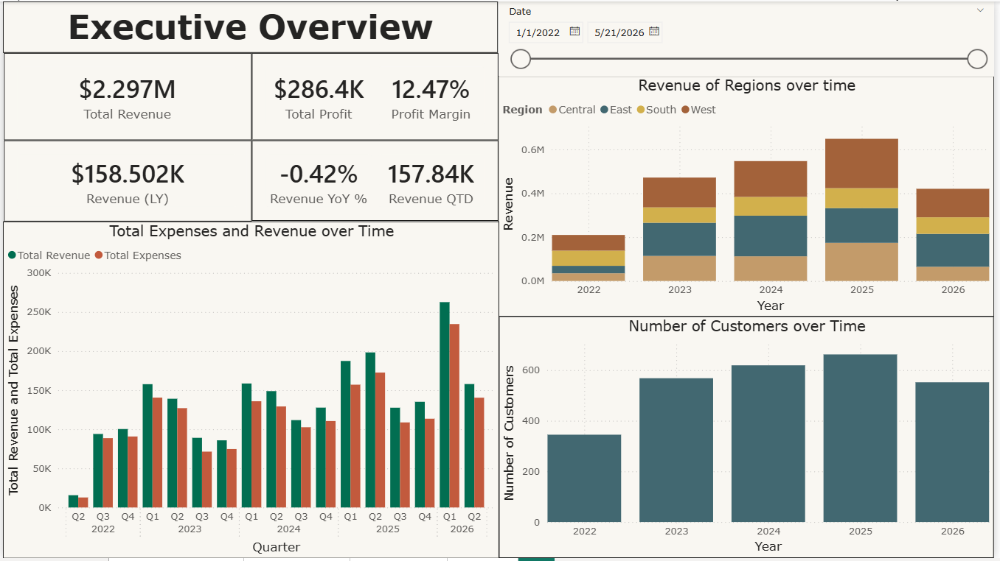
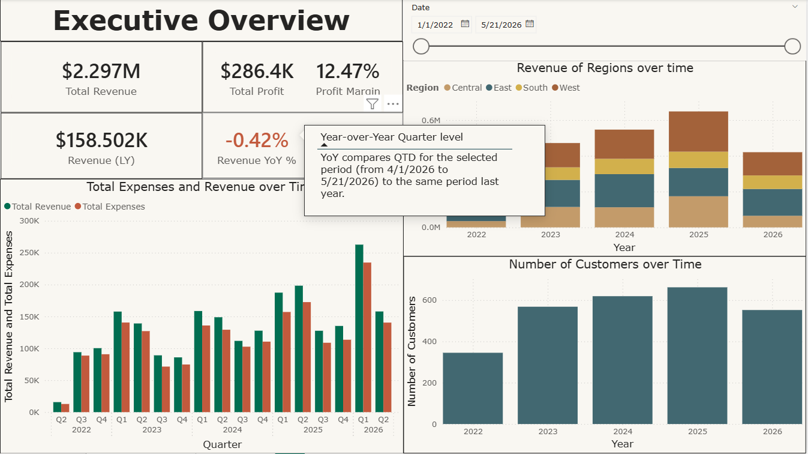

# Superstore-Analysis (Executive Overview Power BI Dashboard)



## 📈 Overview

This Power BI dashboard delivers an **Executive Overview** for sales performance, profitability, and customer metrics over time and by region.  
Key business metrics, trends, and interactive insights are presented in a clean, dynamic interface. Perfect for stakeholders and management.

---

## ✨ Features

- **Dynamic KPIs:**
  - Total Revenue, Total Profit, Profit Margin
  - Revenue QTD (Quarter-to-Date), Revenue LY (Last Year), Revenue YoY % (Year-over-Year %)
- **Time Intelligence:**  
  - All key measures use advanced DAX to provide QTD and YoY comparisons that adapt based on filters and drilldowns
- **Conditional Formatting:**  
  - Revenue YoY % card uses coloring to instantly flag positive/negative trends
- **Interactive Tooltips:**  
  - Custom tooltips on KPI cards explain exactly how QTD and YoY calculations work with current filters
- **Visuals:**
  - Comparative bar charts for Total Revenue vs. Total Expenses across quarters
  - Stacked regional revenue over time  
  - Customer growth trends by year
- **Date Slicer:**  
  - Flexible report date range selection using a timeline slider

---

## 🧐 Interactivity & Usability

- **Drilldown enabled**: Users can explore metrics by different periods (year, quarter, etc.)
- **Responsive visuals**: All figures and graphs update instantly with slicer or filter changes
- **Clear explanations**: Tooltips ensure users understand how KPIs are calculated
- **Conditional highlight**: Revenue YoY % will auto-color green/red based on performance

---

## 📊 DAX Highlights

- Robust use of DAX for context-aware time intelligence:
    ```dax
    Revenue QTD =
        CALCULATE(
            SUM([Sales]),
            DATESQTD('Calendar'[Date])
        )

    Revenue QTD LY =
        CALCULATE(
            SUM([Sales]),
            DATEADD(DATESQTD('Calendar'[Date]), -1, YEAR)
        )

    Revenue YoY % =
        DIVIDE([Revenue QTD] - [Revenue QTD LY], [Revenue QTD LY])
    ```
- All time-based calculations are **anchored to [Calendar][Date]** for accurate filter/drilldown awareness.

---

## 🚀 How to Use

1. **Download `ExecutiveOverview.pbix`**
   - Open in [Power BI Desktop](https://powerbi.microsoft.com/desktop/)
2. **Explore the Dashboard**
   - Use the date slicer and region filters
   - Hover over KPI cards for explanatory tooltips
3. **Review DAX**
   - All key measures are documented in the model

---

## 🔥 Screenshots

| Executive Overview |                  |
|:------------------:|:----------------:|
|  |  |
---

## 🏆 Key Learnings / Techniques

- Advanced **DAX time intelligence** (QTD, YoY, conditional formatting)
- **Context-aware tooltips** for stakeholder clarity
- Professional **dashboard layout** with business-focused visuals
- Robust handling of shifted and potential future dates in data

---

## 📂 Files Included

- `ExecutiveOverview.pbix`: Main Power BI dashboard file
- `/Screenshots/`: Demo screenshots for README/portfolio

---

